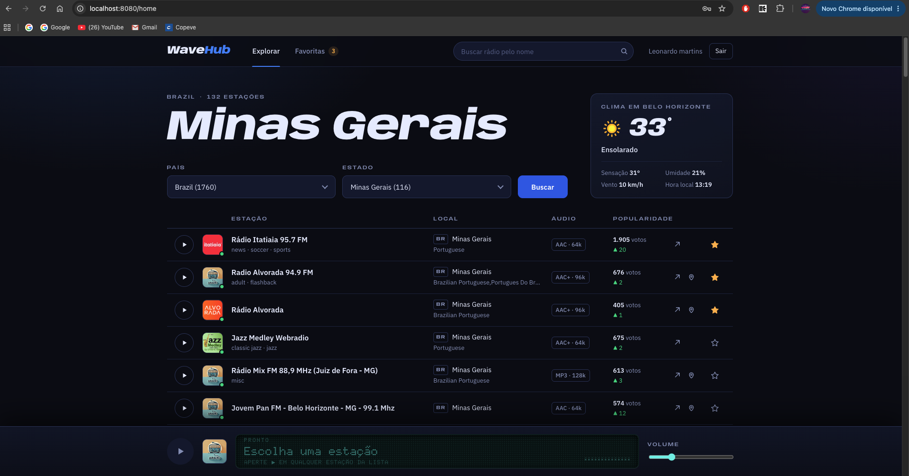
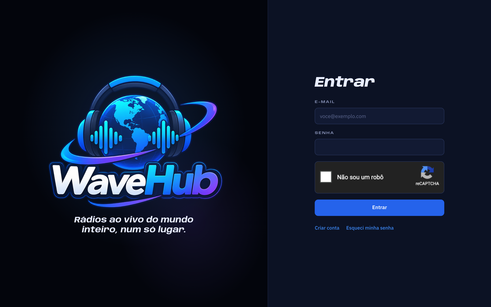
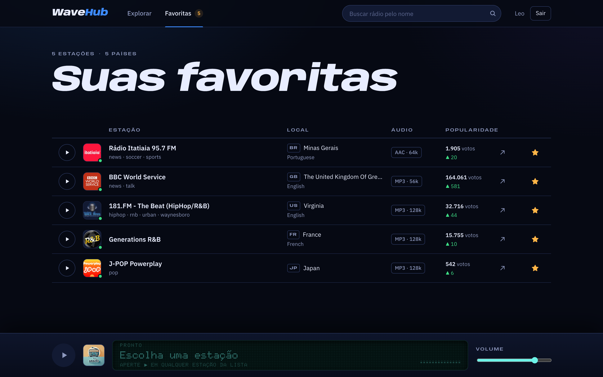
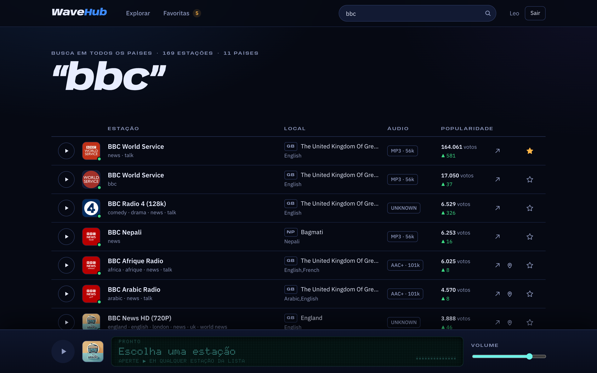
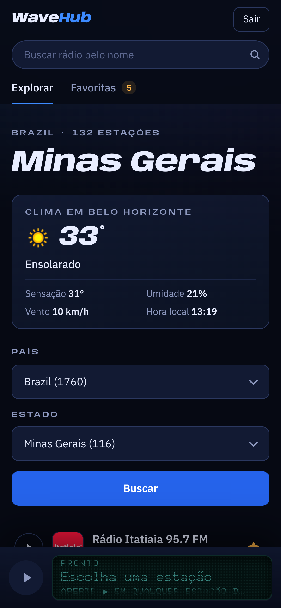
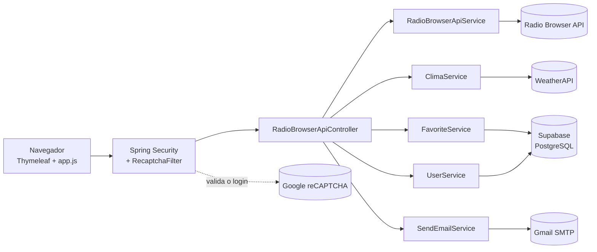
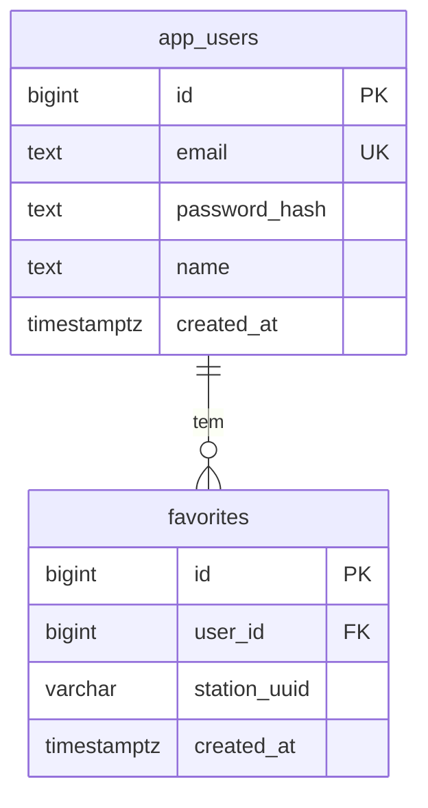

# 🎧 WaveHub — rádios ao vivo do mundo inteiro

Aplicação web em **Java + Spring Boot + Thymeleaf** para ouvir rádios de qualquer país. Você pode filtrar por país e estado, buscar pelo nome, salvar favoritas na sua conta e ver o clima do lugar que está ouvindo.



---

## 📋 Índice

- [Projetos que serviram de base](#-projetos-que-serviram-de-base)
- [Funcionalidades](#-funcionalidades)
- [Telas](#-telas)
- [Tecnologias](#-tecnologias)
- [Arquitetura](#-arquitetura)
- [Como rodar](#-como-rodar)
- [Rotas](#-rotas)
- [Como algumas partes funcionam](#-como-algumas-partes-funcionam)
- [Banco de dados](#-banco-de-dados)
- [Estrutura do projeto](#-estrutura-do-projeto)
- [Problemas comuns](#-problemas-comuns)
- [Links úteis](#-links-úteis)

---

## 🧩 Projetos que serviram de base

O WaveHub junta três projetos anteriores meus:

| Repositório | O que veio dele |
|-------------|-----------------|
| [**RadioBrowserAPI**](https://github.com/leonardoMartins-Dev/SpringBoot/tree/main/RadioBrowserAPI) | Consumo da [Radio Browser API](https://api.radio-browser.info/) para listar estações e tocá-las no navegador. |
| [**TelaLogin**](https://github.com/leonardoMartins-Dev/TelaLogin-SpringBoot-/tree/main/TelaLogin%28Thymeleaf%29/TelaLogin) | Login com Spring Security, cadastro, recuperação de senha por e-mail e Google reCAPTCHA. |
| [**ClimaAPI**](https://github.com/leonardoMartins-Dev/ClimaAPI) | Consulta do clima atual na [WeatherAPI.com](https://www.weatherapi.com/), com a chave guardada no `.env`. |

A partir deles, este projeto passou a ter usuários salvos em banco (PostgreSQL no Supabase), favoritas por usuário, busca por nome, player único e um visual novo.

---

## ✨ Funcionalidades

- **Explorar por país e estado.** As estações vêm ordenadas por votos, com as suas favoritas no topo. A opção "Todos os estados" mostra o país inteiro.
- **Buscar pelo nome em qualquer país.** A barra do topo procura o texto em qualquer parte do nome da rádio (mínimo de 2 letras) e mostra as 200 mais votadas.
- **Favoritas por usuário.** Cada conta tem suas favoritas, salvas no banco. A aba **Favoritas** reúne estações de países e estados diferentes, das mais recentes para as mais antigas. A estrela troca na hora, sem recarregar a página.
- **Player único com visor.** O ▶ de cada estação manda o áudio para o player fixo no rodapé. O visor, em estilo de display de aparelho de som, mostra se a rádio está conectando, ao vivo, parada ou sem sinal. O volume fica guardado no navegador.
- **Clima do lugar.** Na página Explorar, um card mostra temperatura, condição, sensação, umidade, vento e a **hora local** do lugar escolhido.
- **Contas.**
  - Cadastro e login com reCAPTCHA ("Não sou um robô").
  - Recuperação de senha por e-mail, com link válido por 15 minutos.
  - Botão para sair.
- **Responsivo.** Funciona no computador e no celular.

---

## 📸 Telas

| Login | Favoritas (estações de vários países) |
|:-----:|:-------------------------------------:|
|  |  |

| Busca por nome em todos os países | Celular |
|:---------------------------------:|:-------:|
|  |  |

---

## 🧰 Tecnologias

**Backend**

- Java 17
- Spring Boot 3.3.5: Web, Thymeleaf, Security, Data JPA e Mail
- PostgreSQL hospedado no [Supabase](https://supabase.com/)
- [spring-dotenv](https://github.com/paulschwarz/spring-dotenv), para ler as chaves do arquivo `.env`
- Maven

**Frontend**

- Thymeleaf, com fragmentos compartilhados entre as páginas (cabeçalho, linha de estação e player)
- CSS puro e JavaScript sem frameworks
- Fontes do Google Fonts: *Anybody* (títulos), *IBM Plex Sans* (texto) e *Doto* (visor do player)

**Serviços externos**

| Serviço | Uso |
|---------|-----|
| [Radio Browser API](https://api.radio-browser.info/) | Estações, países, estados e busca por nome |
| [WeatherAPI.com](https://www.weatherapi.com/) | Clima atual e hora local |
| [Google reCAPTCHA v2](https://developers.google.com/recaptcha/docs/display) | Proteção do login |
| Gmail (SMTP) | Envio do e-mail de recuperação de senha |

---

## 🧱 Arquitetura



---

## 🚀 Como rodar

### Pré-requisitos

- Java 17 ou mais recente
- [Maven](https://maven.apache.org/download.cgi) 3.9 ou mais recente
- Contas gratuitas em: [Supabase](https://supabase.com/), [WeatherAPI.com](https://www.weatherapi.com/signup.aspx) e [Google reCAPTCHA](https://www.google.com/recaptcha/admin). Para o e-mail de recuperação, uma conta do Gmail com [senha de app](https://myaccount.google.com/apppasswords).

### 1. Banco de dados (Supabase)

1. Crie um projeto no Supabase. Se estiver no Brasil, escolha a região **South America (São Paulo)**; ela não pode ser mudada depois.
2. Clique em **Connect**, escolha **Type: JDBC** e **Method: Session pooler**, e anote o host e o usuário (`postgres.<project-ref>`).
3. No **SQL Editor**, rode:

```sql
-- Usuários
create table public.app_users (
  id            bigint generated always as identity primary key,
  email         text not null unique,
  password_hash text not null,
  name          text not null,
  created_at    timestamptz not null default now()
);

-- Favoritas, cada uma com seu dono
create table public.favorites (
  id           bigint generated always as identity primary key,
  user_id      bigint not null references public.app_users(id) on delete cascade,
  station_uuid varchar(64) not null,
  created_at   timestamptz not null default now(),
  unique (user_id, station_uuid)
);

-- Bloqueia o acesso pela API REST do Supabase.
-- A aplicação conecta como postgres (dono das tabelas) e continua funcionando.
alter table public.app_users enable row level security;
alter table public.favorites enable row level security;
```

> As tabelas são criadas por esse SQL. A aplicação usa `spring.jpa.hibernate.ddl-auto=none`, então o Hibernate não altera o banco.

### 2. Chaves no arquivo `.env`

Copie o arquivo de exemplo [`.env.example`](.env.example) para `.env`, na raiz do projeto, e troque os valores pelos seus. O `.env` já está no `.gitignore` e **não vai para o GitHub**.

```bash
cp .env.example .env
```

As chaves que ele precisa ter:

```properties
# Supabase (Session pooler)
SUPABASE_DB_URL=jdbc:postgresql://aws-0-<regiao>.pooler.supabase.com:5432/postgres
SUPABASE_DB_USER=postgres.<project-ref>
SUPABASE_DB_PASSWORD=sua-senha-do-banco

# Gmail (senha de app, não a senha normal da conta)
MAIL_USERNAME=seu-email@gmail.com
MAIL_PASSWORD=sua-senha-de-app

# Google reCAPTCHA v2 ("Não sou um robô"). Inclua "localhost" nos domínios da chave.
RECAPTCHA_SITE_KEY=sua-site-key
RECAPTCHA_SECRET_KEY=sua-secret-key

# WeatherAPI.com
apiKey=sua-chave-da-weatherapi

# Opcional: endereço público do site, usado no link do e-mail de recuperação
# APP_BASE_URL=https://seu-dominio.com
```

### 3. Rodar

```bash
mvn spring-boot:run
```

Acesse [http://localhost:8080/login](http://localhost:8080/login), clique em **Criar conta** e entre.

> Os testes (`mvn test`) sobem a aplicação inteira, inclusive a conexão com o banco, então precisam do `.env` configurado. Para gerar o build sem testar: `mvn clean package -DskipTests`.

---

## 🔗 Rotas

| Método | Rota | O que faz | Precisa de login |
|--------|------|-----------|:----------------:|
| `GET` | `/login` | Tela de login | Não |
| `POST` | `/login` | Login (Spring Security + reCAPTCHA) | Não |
| `GET` / `POST` | `/register` | Cadastro de conta | Não |
| `GET` / `POST` | `/recoverpassword` | Pede o e-mail e envia o link de recuperação | Não |
| `GET` / `POST` | `/resetpassword?token=...` | Define a nova senha | Não |
| `GET` | `/home?country=...&state=...` | Explorar por país/estado (padrão: Brazil / Minas Gerais), com o clima do lugar | Sim |
| `GET` | `/search?q=...` | Busca pelo nome em todos os países | Sim |
| `GET` | `/favorites` | Aba Favoritas | Sim |
| `POST` | `/api/favorites/toggle` | Marca/desmarca favorita e responde em JSON (usado pela estrela) | Sim |
| `POST` | `/favorites/toggle` | Mesma coisa via formulário, para quando o JavaScript falha | Sim |
| `POST` | `/logout` | Sai da conta | Sim |

---

## 🔧 Como algumas partes funcionam

### Player único
Antes, cada estação tinha seu próprio `<audio>`: 132 players em Minas Gerais e 1.759 em "Todos os estados". Agora existe **um único `<audio>`** no rodapé, controlado pelo `app.js`. Como rádio é ao vivo, dar play de novo sempre reconecta ao stream, em vez de continuar de onde parou.

### Estrela sem recarregar a página
Recarregar a página pararia a rádio que está tocando. Por isso a estrela envia o formulário com `fetch` para `/api/favorites/toggle`, com o token CSRF, e só atualiza o ícone. Se o JavaScript falhar ou a sessão expirar, o formulário é enviado do jeito tradicional.

### Clima por coordenadas
Buscar o clima só pelo **nome** do estado erra bastante na WeatherAPI: "Minas Gerais" vira a cidade de Campos Gerais e "Bavaria" cai na Colômbia. Por isso o `ClimaService` usa as **coordenadas da estação mais bem colocada** que tenha localização, o que sempre dá uma cidade real dentro do lugar escolhido, e o card mostra qual cidade é. Se nenhuma estação tiver localização, ele tenta pelo nome e só aceita o resultado se o país bater.

### Menos chamadas externas
- Países e estados ficam em cache (`@Cacheable`) até a aplicação reiniciar.
- O clima de cada lugar fica em cache por 10 minutos, com timeout de 3 segundos: se a WeatherAPI demorar, a página abre sem o card.
- As favoritas do usuário são lidas numa única consulta ao banco por página.

### Segurança
- Senhas guardadas com **BCrypt**.
- Proteção **CSRF** em todos os formulários.
- **reCAPTCHA** validado no servidor por um filtro antes do login (`RecaptchaFilter`).
- Chaves e senhas só no `.env`.
- **RLS** ligado nas tabelas do Supabase.

---

## 💾 Banco de dados



- **`app_users`**: e-mail único, sempre salvo em minúsculas, e senha criptografada com BCrypt.
- **`favorites`**: guarda só o UUID da estação na Radio Browser API. Os dados da rádio (nome, stream, ícone) são buscados na API pelo endpoint `/stations/byuuid`. O `unique (user_id, station_uuid)` impede favoritar a mesma rádio duas vezes.

---

## 📁 Estrutura do projeto

```text
📁 RadioBrowserAPI
├── 📁 imgs                                   # Imagens deste README
├── 📁 src/main/java/com/example/RadioBrowserAPI
│   ├── 📁 application
│   │   └── RadioBrowserApiApplication.java   # Classe main (+ @EnableCaching, @EntityScan, @EnableJpaRepositories)
│   ├── 📁 config
│   │   ├── ApiConfig.java                    # URLs da Radio Browser API
│   │   ├── SecurityConfig.java               # Rotas públicas, login, logout, BCrypt
│   │   ├── RecaptchaFilter.java              # Valida o reCAPTCHA antes do login
│   │   └── UserConfig.java                   # Chaves do reCAPTCHA
│   ├── 📁 controller
│   │   └── RadioBrowserApiController.java    # Todas as rotas da aplicação
│   ├── 📁 exception
│   │   ├── GlobalExceptionHandler.java
│   │   └── SendEmailException.java
│   ├── 📁 model
│   │   ├── AppUser.java                      # Entidade da tabela app_users
│   │   ├── FavoriteStation.java              # Entidade da tabela favorites
│   │   ├── RadioStation.java                 # Estação vinda da Radio Browser API
│   │   └── Clima.java                        # Clima vindo da WeatherAPI
│   ├── 📁 repository
│   │   ├── UserRepository.java
│   │   └── FavoriteRepository.java
│   └── 📁 service
│       ├── RadioBrowserApiService.java       # Estações, países, estados, busca por nome e por UUID
│       ├── ClimaService.java                 # Clima do lugar (WeatherAPI)
│       ├── FavoriteService.java              # Favoritas por usuário
│       ├── UserService.java                  # Cadastro, nome e troca de senha
│       ├── DatabaseUserDetailsService.java   # Carrega o usuário do banco para o login
│       ├── PasswordRecoveryService.java      # Tokens de recuperação (15 min)
│       ├── SendEmailService.java             # Envio de e-mail
│       └── RecaptchaService.java             # Consulta ao Google reCAPTCHA
├── 📁 src/main/resources
│   ├── application.properties
│   ├── 📁 static
│   │   ├── 📁 css
│   │   │   ├── style.css                     # Páginas logadas
│   │   │   └── auth.css                      # Login, cadastro, recuperação e erro
│   │   ├── 📁 js
│   │   │   └── app.js                        # Player e estrela sem recarregar
│   │   └── 📁 imgs                           # Logo e ícone padrão das estações
│   └── 📁 templates
│       ├── error.html
│       ├── 📁 login                          # login, register, recoverpassword, resetpassword
│       └── 📁 user
│           ├── fragments.html                # Cabeçalho, linha de estação e player
│           ├── home.html                     # Explorar
│           ├── favorites.html                # Favoritas
│           └── search.html                   # Busca por nome
├── .env                                      # Chaves (não versionado)
└── pom.xml
```

---

## 🧯 Problemas comuns

| Erro | Causa provável | Solução |
|------|----------------|---------|
| `Could not resolve placeholder '...'` ao iniciar | Falta uma variável no `.env`. | Conferir se o `.env` está na raiz do projeto e tem todas as chaves do passo 2. |
| `NoRouteToHostException` / `UnknownHostException` | Uso da *Direct connection* do Supabase, que só funciona via IPv6. | Usar o **Session pooler** (porta `5432`). |
| `FATAL: Tenant or user not found` | Usuário sem o sufixo `.<project-ref>` ou host de outra região. | Usar `postgres.<project-ref>` e copiar o host exatamente como aparece no **Connect**. |
| `prepared statement "S_1" already exists` | Uso do *Transaction pooler* (porta `6543`). | Usar o **Session pooler** (porta `5432`). |
| reCAPTCHA com "ERRO para o proprietário do site: domínio inválido" | O domínio não está cadastrado na chave. | No [painel do reCAPTCHA](https://www.google.com/recaptcha/admin), adicionar `localhost` (e o domínio de produção). |
| Login sempre volta para "Marque Não sou um robô" | `RECAPTCHA_SECRET_KEY` errada ou de outra chave. | Usar o par *site key* + *secret key* da mesma chave v2. |
| O card de clima não aparece | `apiKey` ausente ou inválida, ou a WeatherAPI demorou mais de 3 s. | Conferir a chave no `.env` e o log (`Erro ao buscar clima...`). |
| E-mail de recuperação não chega | `MAIL_PASSWORD` é a senha normal do Gmail. | Criar uma **senha de app** e usá-la no `.env`. |
| Projeto do Supabase parou de conectar | No plano gratuito, projetos sem uso por cerca de uma semana são pausados. | No painel do Supabase, clicar em **Restore project**. |

---

## 📚 Links úteis

- [Radio Browser API: documentação](https://api.radio-browser.info/)
- [WeatherAPI.com: documentação](https://www.weatherapi.com/docs/)
- [Google reCAPTCHA v2: documentação](https://developers.google.com/recaptcha/docs/display)
- [Supabase: conectando ao Postgres](https://supabase.com/docs/guides/database/connecting-to-postgres)
- [Supabase: Row Level Security](https://supabase.com/docs/guides/database/postgres/row-level-security)
- [Spring Security: documentação](https://docs.spring.io/spring-security/reference/)
- [Spring Data JPA: documentação](https://docs.spring.io/spring-data/jpa/reference/)
- [Thymeleaf: documentação](https://www.thymeleaf.org/documentation.html)

---

## 👤 Autor

Feito por **Leonardo Martins** · [GitHub](https://github.com/leonardoMartins-Dev)

## 📄 Licença

Este projeto está licenciado sob a MIT License.
